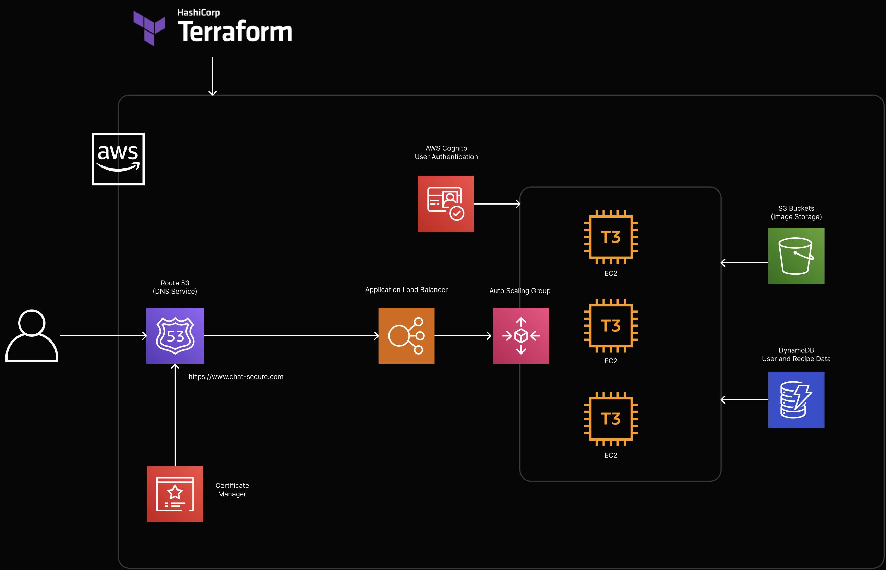

# Chat-Sec: Secure Chat Application

A secure chat application that enables users to communicate with end-to-end encryption and digital signatures.

## Features

- User registration and authentication
- Online/offline status tracking
- Secure key distribution using asymmetric encryption
- End-to-end encrypted messaging using symmetric keys
- Digital signatures using RSA or DSA
- Real-time communication with Socket.IO

## Architecture

- **Frontend**: Next.js (JavaScript)
- **Backend**: Flask with Socket.IO
- **Database**: MongoDB

## Proposed Cloud Infrastructure




## Security Features

- Asymmetric encryption (RSA) for secure key distribution
- Symmetric encryption for chat messages
- Digital signatures using either RSA or DSA
- Secure user authentication

## Setup Instructions

### Prerequisites

- Node.js (v18+)
- Python (v3.8+)
- MongoDB

### Frontend Setup

```bash
cd frontend
npm install
npm run dev
```

### Backend Setup

```bash
cd backend
python -m venv .venv
source .venv/bin/activate
pip install -r requirements.txt
python app.py
```

### Environment Variables

Create `.env` files in both frontend and backend directories with the necessary configuration.

#### Frontend (.env.local)
```
NEXT_PUBLIC_API_URL=http://localhost:5001
NEXT_PUBLIC_SOCKET_URL=http://localhost:5001
```

#### Backend (.env)
```
SECRET_KEY=your_secret_key_here
MONGO_URI=mongo_DB_URI_here

```

## Usage

1. Register an account
2. Log in to the system
3. View online users
4. Start a chat with selected users
5. Exchange encrypted messages
6. Sign messages using RSA or DSA

## Security Implementation Details

### Key Distribution
- Server generates a symmetric key for each chat session
- The symmetric key is encrypted with each participant's public RSA key
- Each user decrypts the symmetric key using their private RSA key

### Message Encryption
- All messages are encrypted using AES with the shared symmetric key
- Only participants with the decrypted symmetric key can read messages

### Digital Signatures
- Users can choose between RSA and DSA for message signatures
- Signatures verify the authenticity and integrity of messages
- Recipients can verify who sent each message
